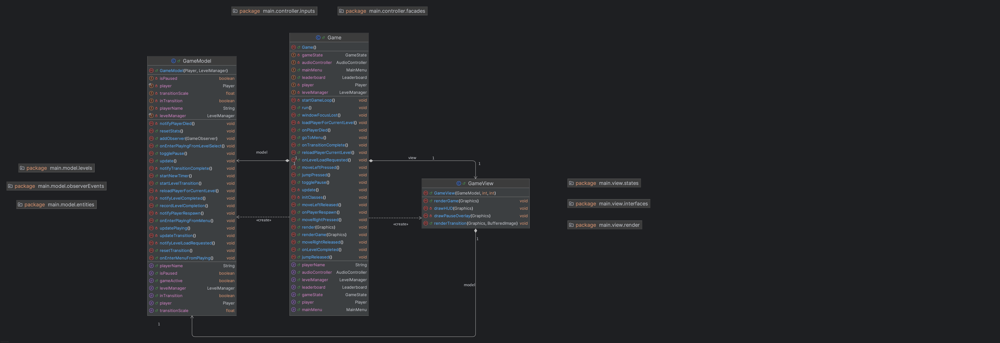
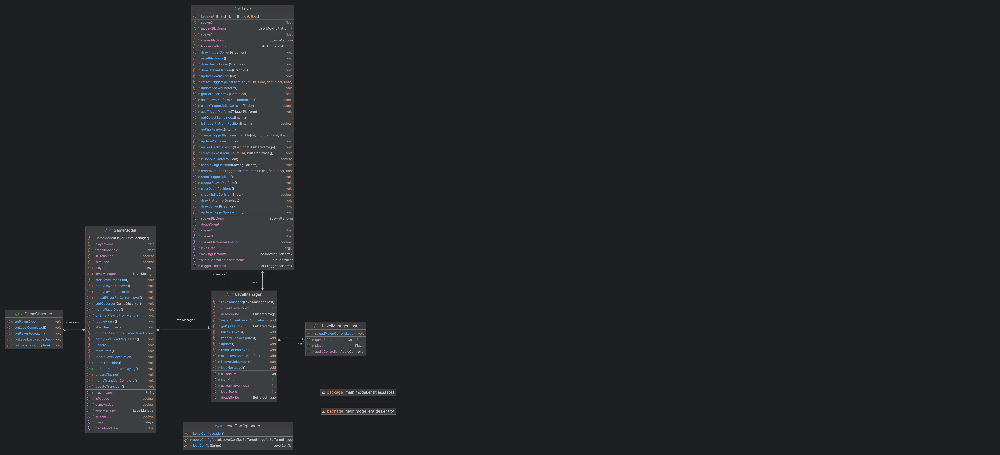
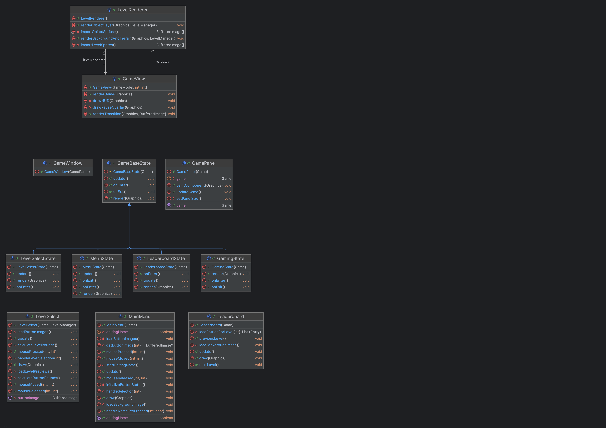
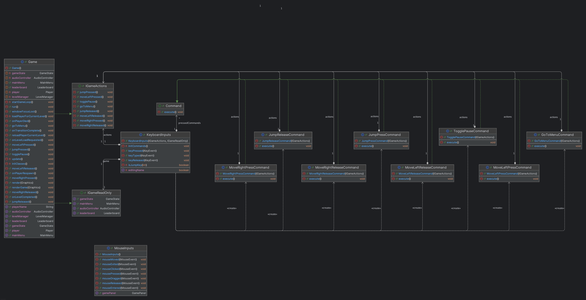
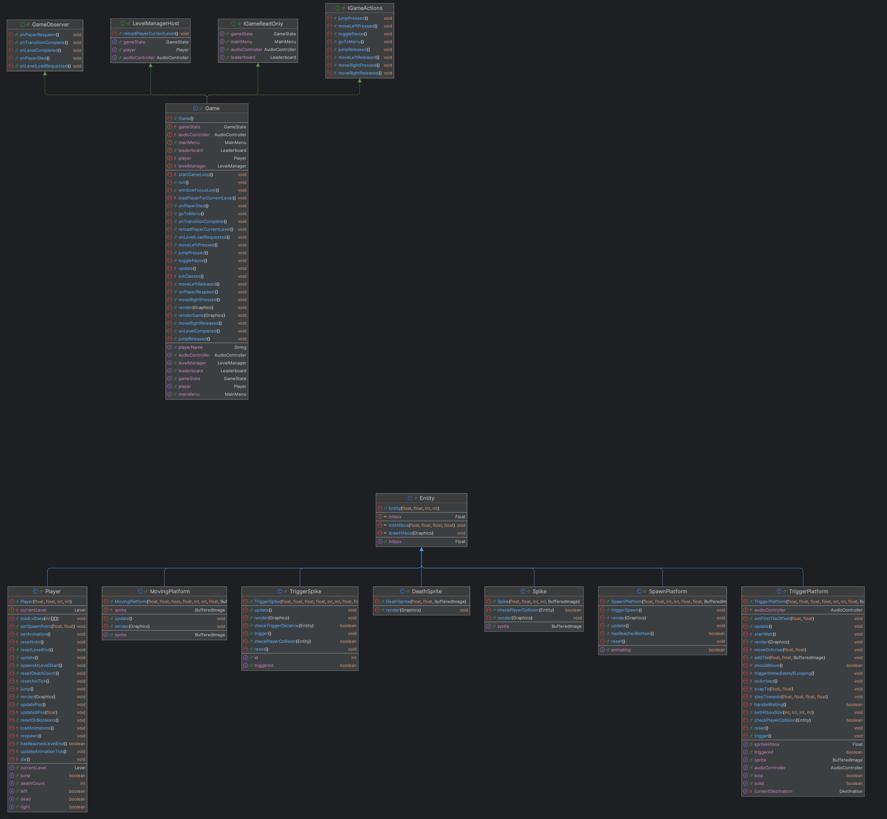

# RUST RUNNER — System Design Document (SDD)

**Project:** RUST RUNNER (desktop 2D platformer)  
**Tech:** Java 17, Swing (UI), JavaFX Media (audio), Maven (build)  

```Rust Runner is a 2D Platform game, inspired by similiar games in the same category, developed for the Object Oriented Programming Project course.```

---

## Developers (Group 16)
- Rayan Ahmad : `RayanAhmad123`
- Philip Hasson : `ChangIkJoong`
- Nadir Morabeth : `nadirmorebytes`
- Oscar Bergdahl : `jojk1`
- Jannah Francine Rosales Beato :`wthjaaa`

---

## 1. Purpose & Scope
This document describes the high-level architecture and some design decisions of **RUST RUNNER**:
- How the game is structured (MVC + Design patterns)
- How the main loop, rendering, input, audio, levels, and persistence interact
- Where to extend the system (new levels, entities, UI states, commands)

---

## 2. System Context
RUST RUNNER is a desktop game built in Java:
- **Inputs:** keyboard + mouse (Swing listeners)
- **Outputs:** rendered frames (Swing `JPanel`) + audio (JavaFX Media)
- **Persistence:** local leaderboard file stored under `src/main/resources/leaderboard.txt`

---

## 3. Architectural Overview
The architecture is primarily:
- **MVC** for gameplay: `GameModel` + `Game` (controller) + `GameView`
- **State**s for the application screens (menu/playing/leaderboard/level-select)
- **Command pattern** for keyboard input mapping
- **Singleton** for audio management (`AudioController`)
- **Entity** pattern for the different entities to be used in the Game Model
- **Facade** pattern as a communicator between components (`IGameRead`, `IGameActions`)
- **Observer** pattern for events in the Game (`GameObserver`)

---

## 4. Module Structure

### 4.1 Entry point
- `application.MainClass`
  - Instantiates the game controller (`new Game()`).

### 4.2 Controller layer
- `main.controller.*`
  - `Game`: application lifecycle owner (creates subsystems, owns loop, switches states). 
  - `Game` : also handles gameplay update logic (delegates to `Player` + `LevelManager`, manages transitions).
  - `main.controller.inputs.*`: keyboard/mouse handling.
  - `main.controller.inputs.commands.*`: command objects used by keyboard mapping.

### 4.3 Model layer
- `main.model.*`
  - `GameModel`: gameplay state container (pause/transition/stats).
  - `main.model.Levels.*`: `LevelManager`, `Level`, `LevelConfigLoader`.
  - `main.model.entities.*`: entity models (player/platform/spikes/etc.).

### 4.4 View layer
- `main.view.*`
  - `GamePanel`: Swing `JPanel`, attaches listeners, calls `game.render(g)` in `paintComponent`.
  - `GameWindow`: Swing `JFrame` wrapper.
  - `GameView`: rendering of the world + HUD + transition overlay.
  - `main.view.states.*`: menu/level-select/leaderboard view implementations.
  - `main.view.interfaces.*`: state wrappers (`GameBaseState`, `MenuState`, `GamingState`, etc.).

### 4.5 Utilities
- `utilities.*`
  - `LoadSave`: resource loading (images / levels / leaderboard file I/O).
  - `HelpMethods`: collision helpers and tile checks.

### 4.6 Audio
- `audio.controller.AudioController`
  - JavaFX bootstrapping + MediaPlayer/AudioClip management.

---
## 5. UML Diagrams

This UML shows the overview MVC split used in the project.
Game owns both the model and view, runs the game loop, and decides which screen state is active.
- `Game` acts as the Controller. it creates the model and view, owns the game loop thread, and selects which screen state is active.
- `GameModel` is the Model. it updates player and level logic, manages this, and raises gameplay events.
- `GameView` (with `GamePanel`) was developed as the View, it renders by reading model state, while Swing controls the actual paint timing.
Communication back from model to controller has been initiated to do via GameObserver callbacks (Observer pattern).


This UML is displaying internal structure of the Model layer.
`GameModel` is the top-level `Model`, it owns the Player and LevelManager, and coordinates update flow, pause, transition state, timing, and scorings.
`LevelManager` in turn also owns the current Level and handles level progression and updating level entities,`Level` contains level-specific data such as tile grids and collections of in-level entities (platform/spike/trigger objects). `GameObserver` is the outward-facing model event interface used to report domain events (death/respawn/completion/transition hooks).



This UML shows how rendering and screen/UI composition is structured:
`GamePanel` is the Swing JPanel and the paint entry point, it calls back into `Game` and it's `render(Graphics)` from `paintComponent`,`GameView` is all about gameplay rendering, reading model state and delegating level-layer drawing to `LevelRenderer`.
`GameBaseState` and its concrete derivatives and ```MenuState, GamingState, LeaderboardState, LevelSelectState``` provides the different states that Game can switch inbetween.
Screen implementations (```MainMenu, Leaderboard, LevelSelect```) encapsulate drawing and UI behavior for their respective screens.



This UML is visualizing the input pipeline using the Command pattern, and in turn also the `Controller`.
Keyboard events are received by `KeyboardInputs`, which in turn maps key presses/releases to Command objects (for example to move left press/release, jump press/release).
Each Command calls IGameActions (implemented by `Game`) to mutate gameplay state (mostly by setting booleans on Player or toggling pause / changing state).
IGameRead is used by inputs for “read/utility” access such as current GameState, menu name-editing state, leaderboard navigation, and audio playback.
(IGameRead is IGameReadOnly due to faulty commits and pulls by our team last-minute).



This UML shows the abstractions used to reduce coupling between major components, as well as our entity based relationship for the models of the
created in-game entities.
IGameActions and IGameRead act as thin Facades interfaces around Game, so input handlers and commands don’t depend fully on
the controller class. GameObserver is the observer interface that allows the model (GameModel) to act with events without
knowing about UI/audio.
GameBaseState provides a shared interface for “screen states” so
the controller can swap between menu/play/leaderboard/level-select without embedding screen logic into Game.

For the Entity pattern, we currently chose to actually still have the rendering of each component within each entity class.
This was for our own sanity and modularisation, there was less to be redone in View later on in-case we would add more entities,
and as a group of 5 people, switching between different codebases, modules or classes makes it even more confusing.

---

## 6. Runtime Overview

### 6.1 Startup
1. `MainClass.main()` creates `new Game()`.
2. `Game` initializes:
   - `AudioController` (singleton)
   - `LevelManager` + `Player`
   - `GameModel` + `Game` + `GameView`
   - UI: `GamePanel` + `GameWindow`
3. `Game` starts the game loop thread (`implements Runnable`).

### 6.2 Main Loop (Update + Render)
The loop uses a fixed time-step approach:
- **UPS**: logic updates per second
- **FPS**: renders per second (via `JPanel.repaint()`)

Conceptual flow:
- Update tick:
  - If in transition -> update transition scale + load next level at peak scale.
  - Else -> delegate update to the currently active screen state.
- Render tick:
  - `GamePanel.paintComponent()` -> calls `game.render(g)`
  - State renders the correct view (menu, level select, leaderboard, or gameplay)
  - Transition overlay is drawn on top (if active)

---

## 7. States
The application uses a **state** pattern to swap whole-screen behavior without mixing UI logic:
- Menu (`MenuState`) -> `MainMenu.draw/update`
- Playing (`GamingState`) -> `GameView.renderGame` + gameplay loop
- Level Select (`LevelSelectState`) -> `LevelSelect.draw/update`
- Leaderboard (`LeaderboardState`) -> `Leaderboard.draw/update`

---

## 8. Input Handling
Keyboard input uses the **Command pattern**:
- `KeyboardInputs` maps key press/release events to `Command` objects.
- Each `Command.execute()` performs one action (move/jump/pause/go-to-menu).

Mouse input is routed by current state (menu and level-select buttons):
- `MouseInputs` reads `game.getGameState()` and calls `mainMenu.*` or `levelSelect.*` handlers.

---

## 9. Level System & Data

### 9.1 Level assets
Levels are defined using:
- **PNG maps** in `src/main/resources/`:
  - Tile layer (red channel)
  - Obstacle layer (green channel)
  - Object layer (blue channel)
- **Text config** (`level1.txt` … `level7.txt`) loaded via `LevelConfigLoader`:
  - Player spawn
  - Spawn platform config
  - Trigger platforms and spikes

### 9.2 LevelManager responsibilities
`LevelManager`:
- Builds all levels at startup
- Tracks `currentLevelIndex`
- Tracks `completedLevels` to implement level unlocking
- Draws layers and level entities (tiles, objects, platforms, spikes, death sprites)

---

## 10. Rendering
Rendering is done using Java2D (`java.awt.Graphics`) on Swing components:
- `GamePanel` is the main drawing surface.
- `GameView` is responsible for:
  - background + tile layers + objects
  - player rendering
  - HUD and pause overlay
  - transition effect overlay (scaled image centered on the player)

---

## 11. Audio
Audio is centralized in `AudioController` (Singleton):
- Initializes JavaFX runtime once (`Platform.startup`)
- Uses:
  - `MediaPlayer` for looping background music (menu vs gameplay)
  - `AudioClip` for sound effects (jump, death, respawn, next level, platform)


---

## 12. Leaderboard Scoring and Game Logic
Leaderboard entries are stored as lines:

`name;levelNumber;deaths;timeSeconds`

Where:
- `levelNumber` is 1-based
- `timeSeconds` uses a dot decimal separator on write, and accepts comma/dot on read

Implementation details:
- Writing: `LoadSave.appendToScoreFile(...)` (append-only)
- Reading: `LoadSave.readScoreFile()`
- Display: `Leaderboard` filters per level, sorts by **fewest deaths** then **lowest time**, and shows **top 5**

---

## 13. How to expand

### 13.1 Adding a new level
- Add new PNG maps to `src/main/resources/` (tile/obstacle/object)
- Add a `levelN.txt` config file (spawn/platform/spike configs)
- Extend `LevelManager.buildAllLevels()` to include the new level

### 13.2 Adding a new screen/state
- Implement a view in `main.view.states.*`
- Create a state wrapper in `main.view.interfaces.*` (extend `GameBaseState`)
- Add a new `GameState` enum value and transition logic in `Game`

### 13.3 Adding a new key binding
- Implement a new `Command` in `main.controller.inputs.commands.*`
- Register it in `KeyboardInputs.initCommands()`